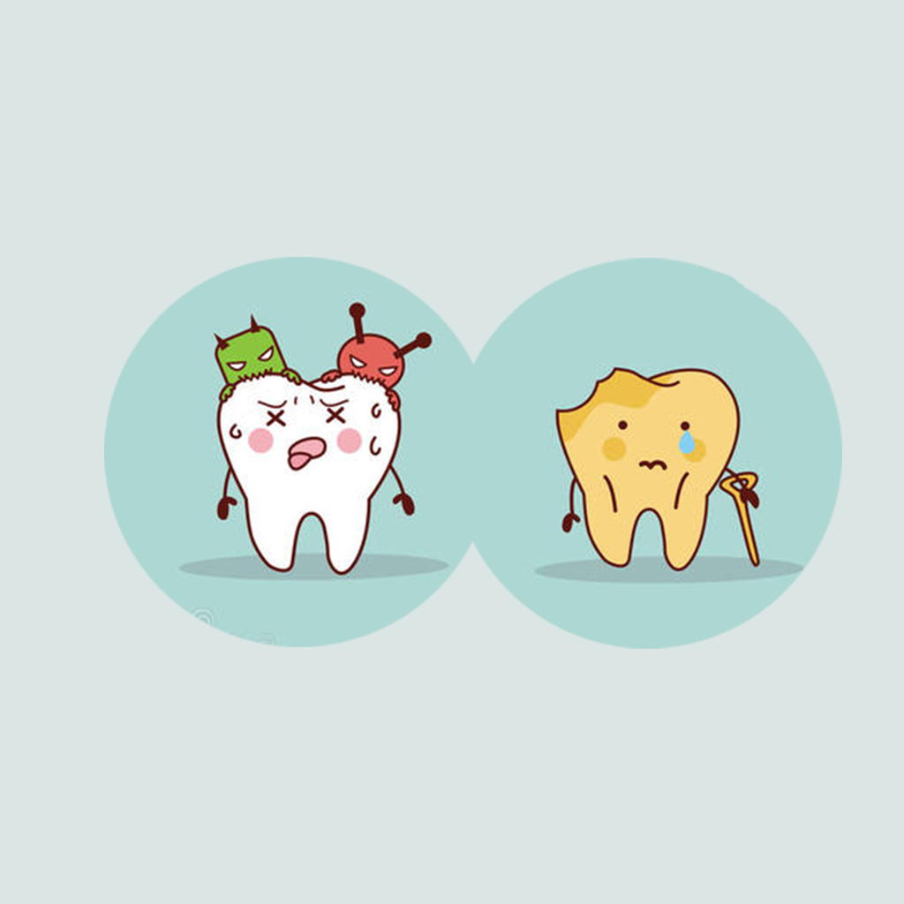

## Welcome to Daughter Decayed Teeth Record

Have you ever had a situation where your daughter often has cavities, or when cavities are painful? In this situation, we as parents must be very worried and sad. To try to avoid this, keep an eye on your daughter's dental health and keep track of when, how often and how many cavities she has, how she feels and what the pain is like. You can put these records together to help your daughter manage healthy teeth and happy growth.

If you have any questions, you can either leave a message or send the questions to our email address.

We will answer them for you in the first time.

### Address: sun778297ma@163.com

Thank you!
